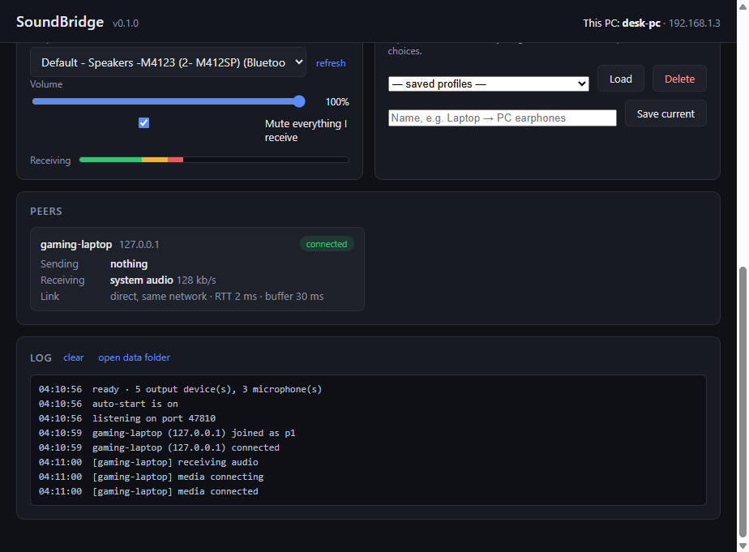
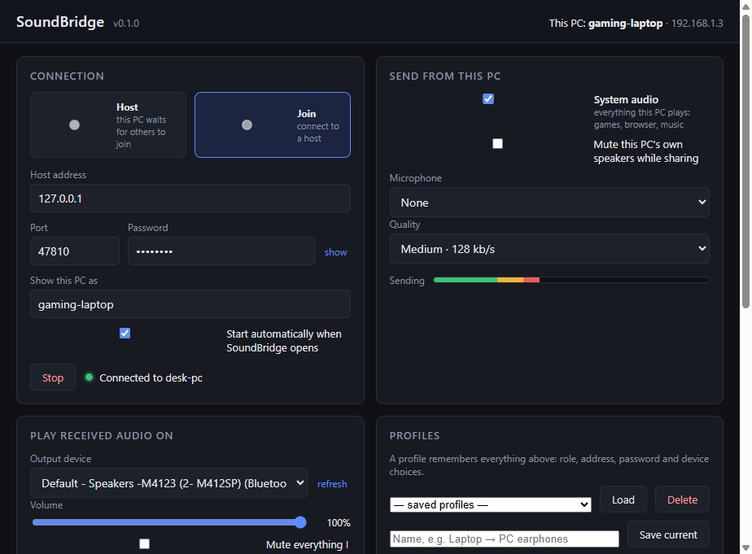

# SoundBridge

[](https://github.com/aakashchamola/soundbridge/actions/workflows/build.yml)
[](https://github.com/aakashchamola/soundbridge/releases/latest)
[](LICENSE)


Send one Windows PC's **speaker output** (or a microphone) to another PC's **headphones**
over the network, protected by a password. Free, open source, no accounts, no cloud.

The case it was built for: you are on Discord on your PC with earphones plugged in, and
you are playing a game on a laptop. SoundBridge sends the laptop's game audio to the PC,
where it plays into the same earphones alongside Discord.

```
 Laptop (game)                                PC (Discord + earphones)
 ┌──────────────────┐   password-locked        ┌──────────────────┐
 │ SoundBridge JOIN │ ───── WebSocket ───────► │ SoundBridge HOST │
 │ • system audio ✓ │   then WebRTC audio      │ • output: earph. │
 │ • quality: high  │ ═════ Opus/SRTP ═══════► │ • volume slider  │
 └──────────────────┘                          └──────────────────┘
```

| Host side, receiving | Joiner side, sharing system audio |
|---|---|
|  |  |

## Features

- **System audio capture** on Windows (WASAPI loopback), or any microphone. Optionally
  mutes the sending PC's own speakers while it shares.
- **Any output device** on the receiving side (earphones, speakers, a virtual cable),
  with its own volume and mute.
- **Password-protected.** The password never crosses the wire (PBKDF2 + AES-256-GCM
  signaling, DTLS-SRTP audio). A wrong password gets a closed socket, nothing else.
- **Works across networks.** Direct peer-to-peer on a LAN; over the internet with one
  port forward on the host.
- **Quality knob** from 64 to 510 kb/s Opus stereo, changeable live. 10 ms packets,
  in-band FEC, no DTX.
- **Both directions, many peers.** Any side can send system audio and/or a mic; a host
  accepts several joiners at once.
- **Profiles** remember a whole setup (role, address, password, devices, quality), and
  *Start automatically when SoundBridge opens* makes it a one-click bridge.
- **Live stats** per peer: bitrate, round-trip time, jitter-buffer delay, link path.
- Automatic reconnection and ICE restarts when the network hiccups.
- Small, plain code: Electron + `ws`, no frameworks, no native modules, no build step.

## Download

From the [latest release](https://github.com/aakashchamola/soundbridge/releases/latest):

| File | What it is |
|---|---|
| **`SoundBridge-Setup-<version>.exe`** | Installer. Per-user (no admin), Start Menu and desktop shortcuts, uninstaller in *Apps & features*. |
| `SoundBridge-win-x64-<version>.zip` | Portable folder. Unzip anywhere, run `SoundBridge.cmd`. Nothing is installed. |
| `SHA256SUMS.txt` | Checksums of both. |

Settings and profiles live in `%APPDATA%\soundbridge\` either way.

**Windows SmartScreen will warn** ("Windows protected your PC") when you run the
installer, because it is not code-signed; click *More info* → *Run anyway*. A signing
certificate costs real money per year and this project has none yet. If you would rather
not click through that, the portable zip keeps the stock, code-signed `electron.exe`
(not renamed, not re-stamped), so SmartScreen and Smart App Control have nothing to
complain about. Both are built from this repository by GitHub Actions on every tagged
release; nothing is uploaded from a personal machine.

## Quick start: laptop game audio into PC earphones

On the **PC** (the one with the earphones):

1. Choose **Host**, set a password (4+ characters), leave the port at 47800.
2. Under *Play received audio on*, pick your earphones.
3. Click **Start**. Allow it in the Windows Firewall prompt (private networks).
   The card shows what to type on the other machine, e.g. `192.168.1.3:47800`.

On the **laptop** (the one playing the game):

1. Choose **Join**, enter the PC's address and the same password.
2. Tick **System audio**. Tick *Mute this PC's own speakers* if you don't want the laptop
   to play the game too.
3. Click **Start**. Within a couple of seconds the PC's Peers card shows
   `connected · receiving system audio`.

Save each side as a profile and tick *Start automatically* so it reconnects on launch.

### From a different network

The host must be reachable on its port: forward **TCP 47800** on the host's router to the
host PC, and enter the host's public address (or a dynamic-DNS name) on the joiner. Audio
packets are UDP and find their way with STUN; only the small signaling connection needs
the port forward. Drop Quality to Medium or Low if the sender's upload is weak.

Symmetric or carrier-grade NAT can defeat STUN. Adding a TURN relay (a `turn:` entry in
`ICE_SERVERS` in `renderer/app.js`) fixes that; it is not bundled because it needs a
server of your own.

## Latency

Measured on one PC talking to itself: the receiver's jitter buffer sat at about 30 ms on
an idle machine and grew to about 140 ms while the same machine was busy zipping the
build. Add capture and playout and expect roughly 60 to 100 ms end to end on a wired or
good Wi-Fi LAN, about the same as Bluetooth headphones. The Peers card shows the live
figure. A native WASAPI implementation could get under 30 ms; that is the next step if
the delay bothers you while gaming.

## Build from source

Requirements: Node 20 or newer and npm. Electron 39 is pinned because Electron 40+
needs Node 22 to install. Nothing is required on the target PC beyond the packaged
folder.

```powershell
git clone https://github.com/aakashchamola/soundbridge
cd soundbridge
npm install
npm start            # run from source
npm test             # signaling handshake tests
npm run test:e2e     # host + joiner on this PC, screenshots in dist\e2e\
npm run pack         # portable: dist\SoundBridge\ and dist\SoundBridge-win-x64-<version>.zip
npm run dist         # installer: dist\installer\SoundBridge-Setup-<version>.exe (electron-builder, NSIS)
npm run icon         # re-render assets\icon.svg to assets\icon.png
```

To cut a release: bump `version` in `package.json`, add the section to `CHANGELOG.md`,
commit, then `git tag v<version> && git push --tags`. The `release` workflow builds
both artifacts, writes `SHA256SUMS.txt`, and publishes the GitHub release with the
changelog section as its notes.

If you launch from a VS Code terminal and the window never appears, unset
`ELECTRON_RUN_AS_NODE` first (VS Code sets it, and it makes `electron.exe` behave like
node).

## How it works

Two Electron processes per machine: the **main** process runs the password-protected
WebSocket signaling (as server on the host, as reconnecting client on the joiner) and the
settings store; the **renderer** captures audio, runs one `RTCPeerConnection` per peer
with perfect negotiation, and plays received tracks through `<audio>` elements routed
with `setSinkId`. Only SDP and ICE candidates cross the signaling channel, encrypted;
audio goes peer-to-peer over WebRTC.

The full story, including the handshake, the SDP tuning, and the threat model, is in
[docs/ARCHITECTURE.md](docs/ARCHITECTURE.md).

## Documentation

| Document | What it covers |
|---|---|
| [docs/ARCHITECTURE.md](docs/ARCHITECTURE.md) | processes, signaling protocol, WebRTC negotiation, capture, playback, storage, test hooks, threat model |
| [docs/TROUBLESHOOTING.md](docs/TROUBLESHOOTING.md) | every failure mode seen so far and what to do about it |
| [CONTRIBUTING.md](CONTRIBUTING.md) | dev setup, tests, layout, ground rules, good first issues |
| [CHANGELOG.md](CHANGELOG.md) | release history |

## Project layout

| Path | What |
|---|---|
| `main.js` | Electron main: window, loopback permission, signaling host/client, store |
| `preload.js` | The tiny `window.sb` bridge the page uses |
| `lib/signaling.js` | Password-authenticated, encrypted WebSocket signaling |
| `lib/store.js` | Atomic JSON settings/profile store |
| `renderer/` | The UI: capture, WebRTC peers, playback routing, stats, profiles |
| `assets/` | App icon (`icon.svg` source, `icon.png` rendered) |
| `scripts/pack.js` | Builds the portable folder + zip |
| `scripts/render-icon.js` | Renders the icon with Electron's own renderer, no image tools needed |
| `scripts/test-signaling.js` | Handshake, tamper and reconnect tests |
| `scripts/test-e2e.ps1` | Runs a host and a joiner on this PC and screenshots both |
| `.github/workflows/build.yml` | CI on every push: syntax check, tests, installer + portable zip as artifacts |
| `.github/workflows/release.yml` | On a `v*` tag: builds both, checksums them, publishes the GitHub release |

The password is stored in plain text in `settings.json` / `profiles.json` in your own
profile folder, the same way Wi-Fi passwords are; keep that folder to yourself.

## Not done yet

- **Mic into Discord**: SoundBridge can already send a mic to the other PC and play it on
  any output device, but Discord only reads from *input* devices. To feed it, install a
  virtual cable (VB-CABLE is free), pick "CABLE Input" as SoundBridge's output device and
  "CABLE Output" as Discord's mic.
- Choosing *which* output device to capture on the sender (it captures the default one).
- A tray icon and start-with-Windows.
- Per-peer volume when several people are connected.
- TURN relay for networks where STUN fails.
- Linux and macOS senders (Chromium's loopback capture is Windows-only).

## License

[MIT](LICENSE).
